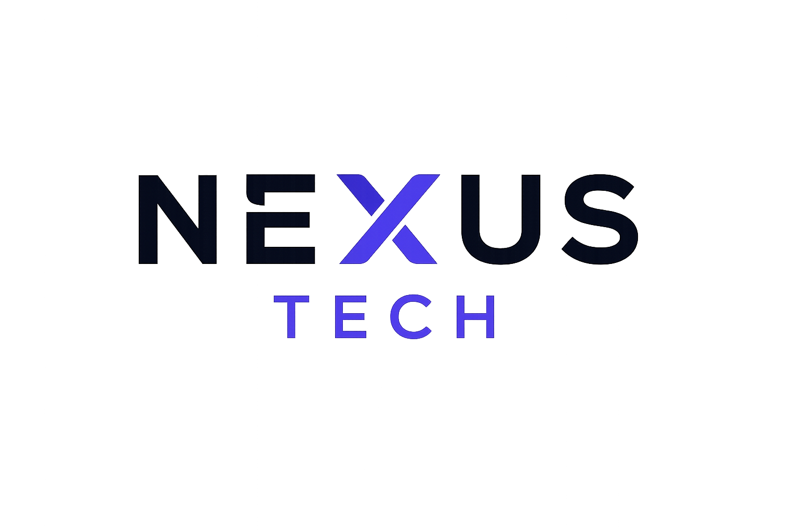

<div align="center">

# ⚡ NEXUS TECH

### El Blog de Tecnología Líder — Construido con HTML5 & CSS3 Puros

Una plataforma completa de blog tecnológico con artículos, reseñas de productos, foro comunitario, calendario de eventos y sistema de contacto — **sin una sola línea de JavaScript.**


<br>

[](https://proyecto-skill-html-css-nexus-tech-phi.vercel.app/)

### 🌐 [Ver Proyecto En Línea →](https://proyecto-skill-html-css-nexus-tech-phi.vercel.app/)

---



</div>

---

## 📑 Tabla de Contenidos

- [Sobre el Proyecto](#-sobre-el-proyecto)
- [Características](#-características)
- [Tecnologías Utilizadas](#-tecnologías-utilizadas)
- [Estructura del Proyecto](#-estructura-del-proyecto)
- [Capturas de Pantalla](#-capturas-de-pantalla)
- [Diseño Responsivo](#-diseño-responsivo)
- [Páginas del Proyecto](#-páginas-del-proyecto)
- [Filosofía de Diseño](#-filosofía-de-diseño)
- [Rendimiento](#-rendimiento)
- [Instalación](#-instalación)
- [Uso](#-uso)
- [Mejoras Futuras](#-mejoras-futuras)
- [Autor](#-autor)
- [Licencia](#-licencia)

---

## 🎯 Sobre el Proyecto

**Nexus Tech** es una plataforma completa de blog tecnológico diseñada para entregar las últimas noticias, reseñas detalladas de productos y una experiencia comunitaria vibrante para entusiastas de la tecnología.

Construida enteramente con **HTML5 y CSS3** — sin JavaScript, sin frameworks, sin bibliotecas externas — este proyecto demuestra el poder de las técnicas modernas de CSS incluyendo **Flexbox**, **CSS Grid**, **Variables CSS**, **Animaciones Keyframe** y el **Hack del Checkbox** para componentes interactivos.

### 🎯 Objetivo

Crear un blog tecnológico visualmente impresionante y completamente funcional que rivalice con aplicaciones web modernas utilizando únicamente HTML semántico y CSS puro. Cada componente, animación e interacción está construido sin depender de JavaScript.

### 👥 Público Objetivo

- Entusiastas de la tecnología y early adopters
- Desarrolladores de software e ingenieros
- Periodistas y reseñadores de productos tecnológicos
- Comunidades de forums tech
- Estudiantes de desarrollo web Frontend

### 🏆 Logros Clave

- ✅ **6 páginas** completamente diseñadas y funcionales
- ✅ **13 archivos CSS** organizados de forma modular
- ✅ **20 artículos** únicos con imágenes reales
- ✅ **40+ imágenes** del proyecto descargadas y optimizadas
- ✅ **0 dependencias externas** — solo HTML y CSS puro
- ✅ **100% responsive** — funciona en todos los dispositivos
- ✅ **Interactividad CSS-only** — modales, acordeones y menús sin JS

---

## ✨ Características

### 🏠 Página Principal (Home)

- Hero animado con efectos de partículas CSS puro
- Carrusel de artículos destacados
- Sección de newsletter con diseño glassmorphism
- Footer completo con links sociales

### 📰 Página de Categorías

- **20 artículos tecnológicos** únicos organizados en 6 categorías
- Sidebar de filtros interactivos con checkbox hack
- Sistema de paginación decorativo
- **20 modales** que se abren al hacer clic en "Leer más"
- Cada artículo tiene imagen única de Pexels

### ⭐ Página de Reseñas

- 4 tarjetas de productos de hardware destacados
- Sistema de **estrellas con medias estrellas** (CSS puro)
- Tabla comparativa de especificaciones técnicas
- Sección de "Dejar Reseña" con formulario
- Reseñas de usuarios con estrellas interactivas

### 💬 Página de Comunidad

- 8 temas de discusión del foro
- Sidebar de tendencias y contribuidores destacados
- **14 modales** de discusión con contenido detallado
- **Acordeón FAQ** con 10 preguntas (checkbox hack)
- Directrices de la comunidad y estadísticas

### 📅 Página de Eventos

- Calendario mensual interactivo (Mayo 2026)
- 8 eventos tecnológicos destacados con imágenes reales
- Timeline de eventos pasados
- 8 sitios oficiales de eventos
- 8 categorías de eventos
- Estadísticas del sector

### 📧 Página de Contacto

- Formulario con **validación HTML5** completa
- Tarjetas de información de contacto
- **Google Maps** integrado (iframe)
- 6 iconos de redes sociales con colores por marca
- Tarjetas de contacto rápido
- FAQ de contacto

### 🎨 Funcionalidades Generales

| Funcionalidad | Descripción |
|---------------|-------------|
| 🍔 **Menú Hamburguesa** | Navegación mobile con toggle CSS-only |
| 🎭 **Modales CSS** | Popups interactivos sin JavaScript |
| 📱 **100% Responsive** | Se adapta a cualquier pantalla |
| 🌙 **Tema Oscuro** | Diseño dark navy con efectos glassmorphism |
| ✨ **Animaciones CSS** | Keyframes para preloader, hover y transiciones |
| 🔗 **Navegación Cruzada** | Todas las páginas enlazadas entre sí |
| 🎨 **Paleta de Colores** | Indigo primario, cyan secundario, púrpura terciario |
| 📐 **CSS Modular** | 13 archivos organizados por componente |
| 🖼️ **Imágenes Reales** | 40+ fotos de Pexels y Unsplash descargadas |
| ♿ **HTML Semántico** | Uso correcto de header, nav, main, section, footer |

---

## 🛠️ Tecnologías Utilizadas

| Tecnología | Uso en el Proyecto |
|------------|-------------------|
| **HTML5** | Markup semántico, formularios, atributos de accesibilidad |
| **CSS3** | Flexbox, Grid, Variables, Animaciones, Transiciones |
| **Google Fonts** | Inter (cuerpo), Space Grotesk (títulos), JetBrains Mono (código) |
| **CSS Checkbox Hack** | Modales, menú mobile, acordeón FAQ — todo sin JS |
| **CSS Keyframes** | Animación del preloader, efectos hover, revelado de scroll |
| **Glassmorphism** | Efectos backdrop-filter blur en tarjetas y overlays |
| **CSS Variables** | Paleta de colores y sistema de espaciado centralizado |
| **Pexels API** | Imágenes de stock gratuitas para artículos y eventos |

> **📌 Nota:** Este proyecto utiliza intencionalmente **cero JavaScript** y **cero frameworks externos** para demostrar las capacidades puras de CSS moderno.

---

## 📁 Estructura del Proyecto

```text
NexusTech/
│
├── index.html                              # Página principal
│
├── pages/
│   ├── categorias.html                     # 20 artículos con filtros
│   ├── resenas.html                        # Reseñas y comparativas
│   ├── comunidad.html                      # Foro y discusiones
│   ├── eventos.html                        # Calendario y eventos
│   └── contacto.html                       # Formulario de contacto
│
├── assets/
│   ├── css/
│   │   ├── main.css                        # Reset base y tipografía
│   │   ├── layout.css                      # Header, nav, sidebar, footer
│   │   ├── components.css                  # Tarjetas, modales, badges
│   │   ├── filters.css                     # Estilos de filtros sidebar
│   │   ├── responsive.css                  # Media queries globales
│   │   ├── reviews.css                     # Estilos página de reseñas
│   │   ├── community.css                   # Estilos página comunidad
│   │   ├── eventos.css                     # Estilos página eventos
│   │   ├── contact.css                     # Estilos página contacto
│   │   ├── index-main.css                  # Estilos base del index
│   │   ├── index-layout.css                # Layout del index
│   │   ├── index-components.css            # Componentes del index
│   │   └── index-responsive.css            # Responsive del index
│   │
│   ├── img/
│   │   ├── logo-sin-fondo.png              # Logo de Nexus Tech
│   │   ├── img-home.png                    # Imagen hero principal
│   │   ├── ia.jpg                          # Artículo IA
│   │   ├── ciberseguridad.jpeg             # Ciberseguridad
│   │   ├── cloud.jpeg                      # Cloud computing
│   │   ├── programacion.jpeg               # Programación
│   │   ├── realidad-virtual.jpeg            # Realidad virtual
│   │   ├── gaget.jpeg                      # Gadgets
│   │   ├── contact-hero.jpg                # Hero de contacto
│   │   ├── contact-map.jpg                 # Mapa de contacto
│   │   ├── categorias/                     # 20 imágenes únicas
│   │   │   ├── cat-transformers-robotics.jpg
│   │   │   ├── cat-chatgpt-assistants.jpg
│   │   │   ├── cat-quantum-cybersecurity.jpg
│   │   │   ├── cat-medical-deeplearning.jpg
│   │   │   ├── cat-neural-networks.jpg
│   │   │   ├── cat-federated-learning.jpg
│   │   │   ├── cat-quantum-computing.jpg
│   │   │   ├── cat-5g-smartcity.jpg
│   │   │   ├── cat-cloud-native.jpg
│   │   │   ├── cat-domestic-robotics.jpg
│   │   │   ├── cat-generative-education.jpg
│   │   │   ├── cat-zero-trust.jpg
│   │   │   ├── cat-kubernetes.jpg
│   │   │   ├── cat-vr-remote.jpg
│   │   │   ├── cat-predictive-ml.jpg
│   │   │   ├── cat-wearables.jpg
│   │   │   ├── cat-edge-computing.jpg
│   │   │   ├── cat-social-engineering.jpg
│   │   │   ├── cat-devops-auto.jpg
│   │   │   └── cat-mixed-reality.jpg
│   │   └── eventos/                        # 9 imágenes de eventos
│   │       ├── event-ces.jpg
│   │       ├── event-google-io.jpg
│   │       ├── event-wwdc.jpg
│   │       ├── event-microsoft-build.jpg
│   │       ├── event-nvidia-gtc.jpg
│   │       ├── event-computex.jpg
│   │       ├── event-gamescom.jpg
│   │       ├── event-web-summit.jpg
│   │       └── event-mwc.jpg
│   │
│   └── icons/
│       └── icon-flecha.png
│
└── README.md
```

---

## 📸 Capturas de Pantalla

### 🏠 Página Principal

<div align="center">

<br>
<em>Hero animado con efectos de partículas CSS y carrusel de artículos destacados</em>
</div>

---

### 📰 Categorías — 20 Artículos Tecnológicos

<div align="center">

*20 artículos únicos organizados en 6 categorías: IA, Ciberseguridad, Gadgets, Desarrollo, Cloud Computing y Tendencias*

</div>

| Artículo | Categoría | Imagen |
|----------|-----------|--------|
| El auge de los Transformers en la robótica moderna | IA | `cat-transformers-robotics.jpg` |
| ChatGPT-5 y la revolución de los asistentes virtuales | IA | `cat-chatgpt-assistants.jpg` |
| Ciberseguridad en la era post-cuántica | Ciberseguridad | `cat-quantum-cybersecurity.jpg` |
| Procesamiento de imágenes médicas con deep learning | IA | `cat-medical-deeplearning.jpg` |
| Redes neuronales spiking: biología inspirando la IA | IA | `cat-neural-networks.jpg` |
| Federated Learning: IA preservando la privacidad | IA | `cat-federated-learning.jpg` |
| Quantum Computing: el futuro del procesamiento | Gadgets | `cat-quantum-computing.jpg` |
| 5G y su impacto en las ciudades inteligentes | Tendencias | `cat-5g-smartcity.jpg` |
| Cloud Native: arquitecturas del futuro | Cloud | `cat-cloud-native.jpg` |
| El renacer de la robótica doméstica | Gadgets | `cat-domestic-robotics.jpg` |
| IA Generativa en la educación personalizada | IA | `cat-generative-education.jpg` |
| Zero Trust: seguridad sin compromisos | Ciberseguridad | `cat-zero-trust.jpg` |
| Kubernetes y la orquestación moderna | Desarrollo | `cat-kubernetes.jpg` |
| El futuro del trabajo remoto con VR | Tendencias | `cat-vr-remote.jpg` |
| Análisis predictivo con machine learning | IA | `cat-predictive-ml.jpg` |
| Wearables de nueva generación | Gadgets | `cat-wearables.jpg` |
| Edge Computing: procesamiento en el borde | Cloud | `cat-edge-computing.jpg` |
| Ataques de ingeniería social en 2026 | Ciberseguridad | `cat-social-engineering.jpg` |
| DevOps y la automatización inteligente | Desarrollo | `cat-devops-auto.jpg` |
| Realidad Mixta: el nuevo paradigma visual | Tendencias | `cat-mixed-reality.jpg` |

---

### ⭐ Reseñas de Hardware

<div align="center">

*4 productos destacados con calificaciones, especificaciones y tablas comparativas*

</div>

| Producto | Categoría | Calificación | Estrellas |
|----------|-----------|-------------|-----------|
| Titanium X1 | Laptops | 9.8/10 | ⭐⭐⭐⭐⭐ |
| Sonic Echo Pro | Audio | 9.5/10 | ⭐⭐⭐⭐⭐ |
| Vision Infinite | Display | 9.2/10 | ⭐⭐⭐⭐⭐ |
| Lumix Cyber | Imagen | 9.9/10 | ⭐⭐⭐⭐⭐ |

---

### 💬 Comunidad

<div align="center">

*Foro de discusión con 8 temas activos, FAQ interactivo y contribuidores destacados*

</div>

| Tema | Autor | Respuestas |
|------|-------|------------|
| El futuro de la IA generativa | Elena Varkov | 24 |
| Comparativa: React vs Vue vs Angular | Marcus Chen | 18 |
| Ciberseguridad empresarial en 2026 | Sara Connor | 15 |
| El auge del edge computing | Alex Rivera | 12 |
| Realidad mixta: ¿el siguiente paso? | Luna Park | 9 |
| DevOps: tendencias emergentes | Carlos Vega | 21 |
| Cloud computing y sostenibilidad | Maya Singh | 7 |
| El futuro del trabajo remoto | Diego Luna | 16 |

---

### 📅 Eventos Tecnológicos

<div align="center">

*8 eventos tecnológicos importantes del año con calendario interactivo*

</div>

| Evento | Fecha | Ubicación |
|--------|-------|-----------|
| CES 2026 | Enero | Las Vegas, USA |
| Google I/O | Mayo | Mountain View, USA |
| Apple WWDC | Junio | Cupertino, USA |
| Microsoft Build | Mayo | Seattle, USA |
| NVIDIA GTC | Marzo | San Jose, USA |
| Computex | Junio | Taipei, Taiwan |
| Gamescom | Agosto | Colonia, Alemania |
| Web Summit | Noviembre | Lisboa, Portugal |

---

### 📧 Contacto

<div align="center">

*Formulario con validación HTML5, Google Maps integrado y redes sociales*

</div>

| Elemento | Descripción |
|----------|-------------|
| Formulario | Nombre, email, asunto, mensaje con validación |
| Información | Email, teléfono, ubicación, horario |
| Mapa | Google Maps iframe de Bucaramanga, Colombia |
| Redes Sociales | X/Twitter, Instagram, LinkedIn, GitHub, YouTube |

---

## 📱 Diseño Responsivo

El proyecto es **100% responsivo** y se adapta perfectamente a todos los dispositivos con **4 breakpoints**:

| Breakpoint | Dispositivo | Cambios Principales |
|------------|-------------|---------------------|
| `1200px` | Laptops grandes | Columnas de grid ajustadas |
| `1024px` | Laptops estándar | Layout de una columna, sidebar se reorganiza |
| `768px` | Tablets | Layout apilado, menú hamburguesa activado |
| `480px` | Móviles | Tarjetas a ancho completo, navegación simplificada |

### Características Responsivas:
- 🍔 **Menú hamburguesa** en mobile (toggle CSS-only con checkbox hack)
- 📱 **Grids apilados** en pantallas pequeñas
- 🖼️ **Tarjetas a ancho completo** en móviles
- 🔤 **Tipografía ajustada** según el breakpoint
- 👆 **Botones touch-friendly** con tamaños adecuados
- 📐 **Sidebars colapsables** en tablets y móviles

---

## 📄 Páginas del Proyecto

| # | Página | Archivo | Descripción |
|---|--------|---------|-------------|
| 1 | 🏠 **Inicio** | `index.html` | Landing page con hero animado, carrusel de artículos, newsletter y footer |
| 2 | 📰 **Categorías** | `pages/categorias.html` | 20 artículos tecnológicos con filtros sidebar, paginación y modales interactivos |
| 3 | ⭐ **Reseñas** | `pages/resenas.html` | Reseñas de hardware con calificaciones por estrellas, tablas comparativas y formulario |
| 4 | 💬 **Comunidad** | `pages/comunidad.html` | Foro con 8 temas, sidebar de tendencias, contribuidores, FAQ y directrices |
| 5 | 📅 **Eventos** | `pages/eventos.html` | Calendario mensual, 8 eventos destacados, timeline, sitios oficiales y categorías |
| 6 | 📧 **Contacto** | `pages/contacto.html` | Formulario con validación, Google Maps, redes sociales e información de contacto |

---

## 🎨 Filosofía de Diseño

### Identidad Visual
- **Tema Oscuro:** Fondo navy profundo (`#0a0f1e`) con acentos indigo (`#6366f1`)
- **Glassmorphism:** Efectos backdrop-filter blur en tarjetas y overlays
- **Tipografía:** Sistema de 3 fuentes — Space Grotesk (títulos), Inter (cuerpo), JetBrains Mono (código)
- **Paleta de Colores:** Indigo primario, cyan secundario, púrpura terciario, con acentos rose

### Principios de Arquitectura
- 📐 **CSS Modular** — Cada página tiene su propio stylesheet dedicado
- 🔄 **Componentes Reutilizables** — Header, footer y patrones de tarjetas compartidos
- 🎯 **Interactividad CSS-Only** — Checkbox hack para modales, navegación y acordeones
- 📱 **Enfoque Mobile-First** — Diseño responsivo desde la base
- 🧩 **Basado en Componentes** — Tarjetas, modales, botones y badges autocontenidos
- 🏗️ **Organización Limpia** — Separación clara entre estructura, componentes y estilos de página

---

## ⚡ Rendimiento

| Métrica | Estado |
|---------|--------|
| 🪶 **Ligero** | Cero dependencias externas — sin frameworks JS |
| ⚡ **Carga Rápida** | CSS puro sin proceso de build requerido |
| 🖼️ **Imágenes Optimizadas** | Imágenes comprimidas para entrega web |
| 📝 **HTML Semántico** | Uso correcto de `<header>`, `<nav>`, `<main>`, `<section>`, `<footer>` |
| 🔄 **CSS Reutilizable** | Estilos compartidos entre páginas reducen el tamaño total |
| 🌐 **Sin Servidor Requerido** | Se abre directamente en cualquier navegador |
| 📦 **Archivos Organizados** | 13 CSS modulares fáciles de mantener |
| 🔍 **SEO Básico** | Etiquetas meta, títulos semánticos y estructura jerárquica |

---

## 🚀 Instalación

### 🔗 Opción Rápida — Ver En Línea

No necesitas instalar nada. Accede directamente al proyecto desplegado:

**👉 [https://proyecto-skill-html-css-nexus-tech-phi.vercel.app/](https://proyecto-skill-html-css-nexus-tech-phi.vercel.app/)**

---

### Opción Local

#### Prerrequisitos
- Un navegador web moderno (Chrome, Firefox, Safari, Edge)
- Un editor de código (VS Code recomendado)

### Pasos

```bash
# 1. Clonar el repositorio
git clone https://github.com/JohanSarmientoCH23/Proyecto_Skill_HTML_CSS_NexusTech.git

# 2. Navegar al directorio del proyecto
cd Proyecto_Skill_HTML_CSS_NexusTech

# 3. Abrir index.html en tu navegador
# Opción A: Hacer doble clic en index.html
# Opción B: Usar Live Server en VS Code
```

### Acceso Rápido
```bash
# Windows
start index.html

# macOS
open index.html

# Linux
xdg-open index.html
```

---

## 📖 Uso

### Navegación
- **Header de Navegación** — Haz clic en cualquier enlace para navegar entre páginas
- **Menú Hamburguesa** — En mobile, toca el icono hamburguesa para abrir el drawer de navegación
- **Links del Footer** — Acceso rápido a todas las páginas desde el pie de página

### Funcionalidades Interactivas
- **Tarjetas de Artículos** — Haz clic en "Leer más" para abrir popups modales detallados
- **Filtros de Categoría** — Usa los filtros del sidebar para navegar artículos por categoría
- **Tabla Comparativa** — Compara especificaciones de productos lado a lado
- **FAQ Acordeón** — Haz clic en las preguntas para expandir/colapsar respuestas (CSS-only)
- **Iconos Sociales** — Pasa el cursor para ver colores de marca específicos por plataforma
- **Formulario de Contacto** — Llena y envía con validación HTML5 integrada
- **Calendario de Eventos** — Navega por el calendario mensual interactivo

---

## 🔮 Mejoras Futuras

| Mejora | Prioridad | Descripción |
|--------|-----------|-------------|
| 🔧 Integración Backend | 🔴 Alta | Conectar con Node.js/Python para datos dinámicos |
| 🔐 Sistema de Autenticación | 🔴 Alta | Login, registro y perfiles de usuario |
| 🗄️ Base de Datos | 🔴 Alta | Almacenar artículos, reseñas y usuarios |
| 💬 Comentarios en Tiempo Real | 🟡 Media | Sistema de comentarios para artículos |
| 🔍 Funcionalidad de Búsqueda | 🟡 Media | Buscar artículos por título, categoría o autor |
| 🌙 Modo Claro/Oscuro | 🟡 Media | Toggle entre temas claro y oscuro |
| 📡 Integración API | 🟡 Media | Conectar con APIs de noticias tecnológicas |
| ♿ Accesibilidad Mejorada | 🟡 Media | Etiquetas ARIA, contraste, navegación por teclado |
| 🔍 Optimización SEO | 🟡 Media | Meta tags, Open Graph, sitemap |
| 📱 Progressive Web App | 🟢 Baja | Instalable como app en dispositivos móviles |
| 📊 Panel de Analíticas | 🟢 Baja | Dashboard de estadísticas del sitio |
| 👤 Perfiles de Usuario | 🟢 Baja | Perfiles personalizados con avatar y bio |

---

## 👨‍💻 Autor

**Nexus Tech Team**

| | |
|---|---|
| 💻 **Desarrollador** | Johan |
| 🐙 **GitHub** | [JohanSarmientoCH23](https://github.com/JohanSarmientoCH23) |
| 🌐 **Proyecto En Línea** | [Vercel Deploy](https://proyecto-skill-html-css-nexus-tech-phi.vercel.app/) |
| 📧 **Email** | chagor04@gmail.com |

---

## 📜 Licencia

Este proyecto está licenciado bajo la **Licencia MIT** — consulta el archivo [LICENSE](LICENSE) para más detalles.

```
MIT License

Copyright (c) 2026 Nexus Tech

Permission is hereby granted, free of charge, to any person obtaining a copy
of this software and associated documentation files (the "Software"), to deal
in the Software without restriction, including without limitation the rights
to use, copy, modify, merge, publish, distribute, sublicense, and/or sell
copies of the Software, and to permit persons to whom the Software is
furnished to do so, subject to the following conditions:

The above copyright notice and this permission notice shall be included in all
copies or substantial portions of the Software.

THE SOFTWARE IS PROVIDED "AS IS", WITHOUT WARRANTY OF ANY KIND, EXPRESS OR
IMPLIED, INCLUDING BUT NOT LIMITED TO THE WARRANTIES OF MERCHANTABILITY,
FITNESS FOR A PARTICULAR PURPOSE AND NONINFRINGEMENT.
```

---

## 🙏 Agradecimientos

- **Pexels** — Por las imágenes de stock gratuitas utilizadas en artículos y eventos
- **Google Fonts** — Por las tipografías Inter, Space Grotesk y JetBrains Mono
- **GitHub** — Por el hosting del repositorio
- **Comunidad Frontend** — Por la inspiración y las mejores prácticas de CSS puro

---

<div align="center">

### ⭐ ¡Dale una estrella al repo si te fue útil!

**Diseñado y desarrollado con ❤️ usando HTML5 y CSS3 puros**

---


</div>
